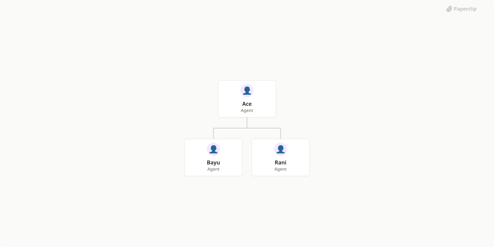

# Ato-team



## What's Inside

> This is an [Agent Company](https://agentcompanies.io) package from [Paperclip](https://paperclip.ing)

| Content | Count |
|---------|-------|
| Agents | 3 |
| Projects | 1 |
| Skills | 7 |
| Tasks | 6 |

### Agents

| Agent | Role | Reports To |
|-------|------|------------|
| Ace | general | — |
| Bayu | pm | ace |
| Rani | researcher | ace |

### Projects

- **Onboarding**

### Skills

| Skill | Description | Source |
|-------|-------------|--------|
| agent-browser | Drive a real browser to inspect or interact with a web page or app — navigate, take screenshots, read console and network, fill simple forms — for verification tasks, not unattended automation. | catalog |
| agentmail | Use your assigned AgentMail inbox to read email tasks, explicitly send or reply, and check delivery. Provided automatically by your inbox assignment. | [github](https://github.com/paperclipai/paperclip/tree/master/skills/agentmail) |
| paperclip-board | Manage a Paperclip company as a board member via chat. Use when the user wants onboarding, company or agent management, approvals, task monitoring, cost oversight, or work product review in the Paperclip control plane. | [github](https://github.com/paperclipai/paperclip/tree/master/skills/paperclip-board) |
| paperclip-converting-plans-to-tasks | Convert Paperclip plans into executable issue graphs. Use when asked to plan, scope, or break down Paperclip company work into assigned tasks with specialty fit, dependencies, blockers, and parallelization. | [github](https://github.com/paperclipai/paperclip/tree/master/skills/paperclip-converting-plans-to-tasks) |
| paperclip-create-agent | Create new agents in Paperclip with governance-aware hiring. Use when you need to inspect adapter configuration options, compare existing agent configs, draft a new agent prompt/config, and submit a hire request. | [github](https://github.com/paperclipai/paperclip/tree/master/skills/paperclip-create-agent) |
| paperclip | Interact with the Paperclip control plane API for task coordination and governance. Use when checking assignments, updating issue status, posting comments, delegating work, managing routines, or calling Paperclip API endpoints. | [github](https://github.com/paperclipai/paperclip/tree/master/skills/paperclip) |
| para-memory-files | Use a file-based PARA memory system to store, retrieve, and organize durable knowledge across sessions. Trigger on saving facts, daily notes, entity records, weekly synthesis, recall, tacit user patterns, or plan memory. | [github](https://github.com/paperclipai/paperclip/tree/master/skills/para-memory-files) |

## Getting Started

```bash
npx paperclipai company import this-github-url-or-folder
```

See [Paperclip](https://paperclip.ing) for more information.

---
Exported from [Paperclip](https://paperclip.ing) on 2026-09-29
